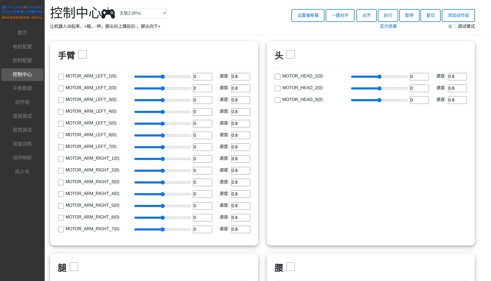

## HTTP手动控制天工机器人 🤖
此部分包含天工2.0plus和天轶2.0Pro。




步骤：
1. 修改 src/robot_control/robot_control/http_control.py 中的数据库以及dist路径。

2. cd 到src上一级 执行
    ```bash
    colcon build --symlink-install
    ```
3. 运行:
    ```bash
    cd src上一级
    export ROS_DOMAIN_ID=0
    source install/setup.bash
    ros2 run robot_control http_conrtol
    ```